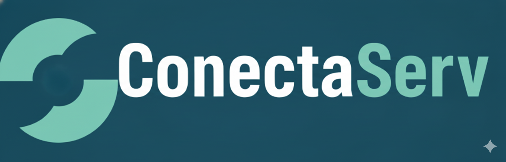

# ConectaServ

> **"Conectando quem precisa a quem sabe fazer"**

---

## 📺 Vídeo de Apresentação (PIT)

Confira a demonstração prática do nosso projeto e das funcionalidades desenvolvidas:

🔗 **Link direto:** [https://youtu.be/6wzdBdC5Kyc](https://youtu.be/6wzdBdC5Kyc)

---

## 📌 Sobre o Projeto

O **ConectaServ** é um website desenvolvido como **Projeto Interdisciplinar (PI)** do 1º Semestre do curso de **Desenvolvimento de Software Multiplataforma** da **Fatec Franca - "Dr. Thomaz Novelino"**.

O objetivo principal foi desenvolver uma solução web responsiva (protótipo navegável) que resolve a dificuldade de encontrar profissionais prestadores de serviço qualificados (como jardineiros, pedreiros, faxineiras) e, ao mesmo tempo, oferece visibilidade para esses profissionais divulgarem seus trabalhos.

---

## 👥 Integrantes do Grupo

Projeto desenvolvido por:

* **Fernando Apolinário Faria**
* **Gabriel Ribeiro da Silva**
* **Marcelo de Almeida Neroni**
* **Matheus Garcia Leite**
* **Thalles Novais**

---

## 🚀 Tecnologias Utilizadas

O projeto foi construído utilizando as tecnologias base do desenvolvimento web, com foco na estruturação, estilização e interatividade:

*  **HTML5:** Estrutura semântica das páginas.
*  **CSS3:** Estilização personalizada e identidade visual (Paleta Azul/Petróleo).
*  **Bootstrap 4:** Framework para layout responsivo e componentes de interface.
*  **JavaScript:** Manipulação de DOM e interatividade das abas.

---

## ⚙️ Funcionalidades do Protótipo

O site conta com 8 páginas navegáveis que simulam a experiência do usuário final:

1.  **Página Inicial (Home):** Apresentação do serviço e busca por cidade.
2.  **Busca:** Listagem de profissionais encontrados com foto e avaliação.
3.  **Perfis Individuais:**
    * Página detalhada do profissional (Ex: Carlos, Marcos, Maria).
    * Visualização de valor e cidade de atendimento.
    * Abas interativas para "Sobre" e "Avaliações de Clientes".
    * Formulário de envio de mensagem (simulado).
4.  **Cadastro:** Formulário para novos profissionais se cadastrarem na plataforma.
5.  **Como Funciona:** Guia passo-a-passo para clientes e profissionais.
6.  **Sobre Nós:** Apresentação institucional e da equipe.

---

## 📋 Documentação de Engenharia de Software

Conforme diretrizes do PI, abaixo estão os requisitos e o modelo de negócio planejados para a aplicação.

### Requisitos Funcionais (RF)
* **RF-01:** O sistema deve permitir buscar profissionais filtrando pela cidade.
* **RF-02:** O sistema deve exibir o perfil do profissional com foto, nome, profissão e avaliação média.
* **RF-03:** O sistema deve permitir o cadastro de novos prestadores de serviço.
* **RF-04:** O sistema deve permitir que o cliente envie uma mensagem direta ao profissional através do perfil.

### Requisitos Não Funcionais (RNF)
* **RNF-01:** O site deve ser responsivo (mobile-friendly).
* **RNF-02:** A interface deve seguir a identidade visual da marca (Cores: #005f73 e #0a9396).
* **RNF-03:** O carregamento das páginas deve ser otimizado para conexões lentas.

### Business Model Canvas (Resumo)
* **Proposta de Valor:** Conectar quem precisa de serviços rápidos com quem sabe fazer, garantindo visibilidade para autônomos e facilidade para contratantes.
* **Segmento de Clientes:** Donos de casa, pequenos comércios e prestadores de serviços gerais.
* **Canais:** Plataforma Web e divulgação local.

---

## 📢 Status do Projeto

> **Status:** ✅ Concluído (Versão 1.0 - Front-end Estático)

Este projeto foi entregue como requisito parcial para a aprovação no 1º Semestre do curso de DSM da Fatec Franca.

---

© 2025 ConectaServ
